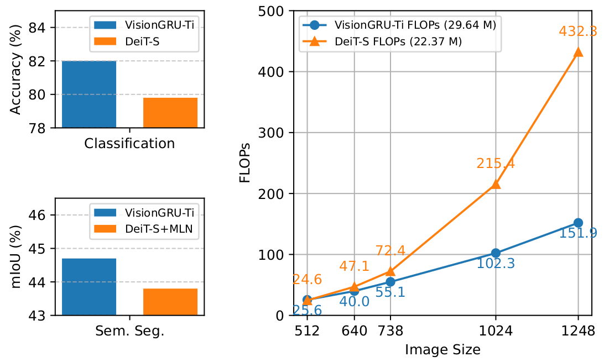
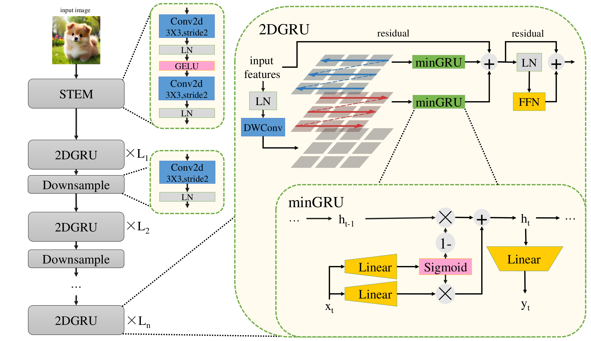

<div align="center">
<h1>VisionGRU </h1>
<h3>VisionGRU: A Linear-Complexity RNN Model for Efficient Image Analysis</h3>

[Kaixuan Yin](https://github.com/ykx3)<sup>1</sup> \*, [Shicheng Yin](https://github.com/yinshicheng)<sup>1</sup> \*, [Weixin Chen]()<sup>1</sup>, [Yang Liu](https://yangliu9208.github.io/)<sup>1</sup><sup> :email:</sup>

<sup>1</sup>  Sun Yat-sen University

(\*) equal contribution, (<sup>:email:</sup>) corresponding author.

[paper](assets/VisionGRU.pdf)

</div>

#

### News

## Abstract
Convolutional Neural Networks (CNNs) and Vision Transformers (ViTs) are two dominant models for image analysis. While CNNs excel at extracting multi-scale features and ViTs effectively capture global dependencies, both suffer from high computational costs, particularly when processing high-resolution images. Recently, state-space models (SSMs) and recurrent neural networks (RNNs) have attracted attention due to their efficiency. However, their performance in image classification tasks remains limited. To address these challenges, this paper introduces VisionGRU, a novel RNN-based architecture designed for efficient image classification. VisionGRU leverages a simplified Gated Recurrent Unit (minGRU) to process large-scale image features with linear complexity. It divides images into smaller patches and progressively reduces the sequence length while increasing the channel depth, thus facilitating multi-scale feature extraction. A hierarchical 2DGRU module with bidirectional scanning captures both local and global contexts, improving long-range dependency modeling, particularly for tasks like semantic segmentation. Experimental results on the ImageNet and ADE20K datasets demonstrate that VisionGRU outperforms ViTs, significantly reducing memory usage and computational costs, especially for high-resolution images. These findings underscore the potential of RNN-based approaches for developing efficient and scalable computer vision solutions.


<div align="center">

</div>

## Overview
<div align="center">

</div>

## Envs. for Pretraining

- Python 3.11.8
  - `conda create -n your_env_name python=3.11.8`

- torch 2.5.1 + cu121
  - `pip install torch==2.5.1+cu121 torchvision==0.20.1+cu121 torchaudio==2.5.1+cu121 --index-url https://download.pytorch.org/whl/cu121`

- Requirements: requirements.txt
  - `pip install -r vig/requirements.txt`


## Train Your VisionGRU
run with this:
```bash
NC={num_gpus} B={batch_size} data_dir={path_to_imagenet} torchrun --nproc_per_node={num_gpus} vig/train.py
```
or export some config before training like this:
```bash
export data_dir={path_to_imagenet}
```
## Model Weights

| Model | #param. | Top-1 Acc. | Checkpoint |
|:------------------------------------------------------------------:|:-------------:|:----------:|:----------:|
| VisionGRU-Ti    |       30M       |   82.0   |  [ckpt](https://huggingface.co/yinkx3/VisionGRU-Ti)| 

## Evaluation on Provided Weights
To evaluate `VisionGRU-Ti` on ImageNet-1K, run:
```bash
data_dir={path_to_imagenet} ckpt={path_to_checkpointfile} torchrun --nproc_per_node={num_gpus} vig/val.py
```